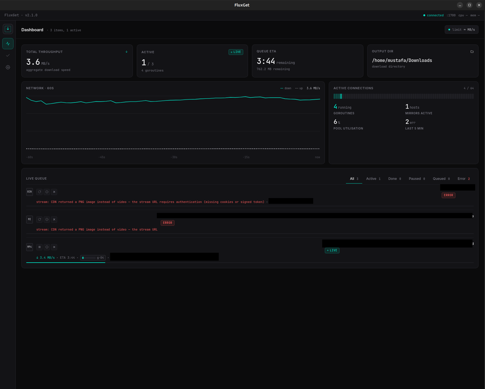
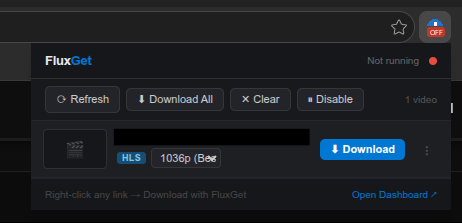
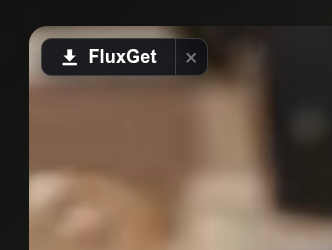
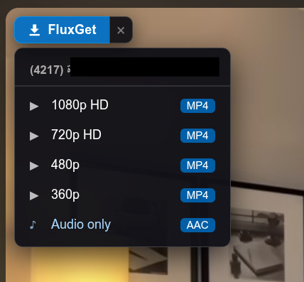

<div align="center">

# FluxGet

**Download manager with native HLS/DASH streaming and browser extension**

[](go.mod)
[](LICENSE)

[**Download**](https://github.com/msh2050/fluxget/releases/latest) • [Screenshots](#screenshots) • [What is this](#what-is-this) • [Why fork](#why-fork-from-surge) • [Features](#features) • [Quick Start](#quick-start) • [GUI](#gui-wails-desktop-app) • [Browser Extension](#browser-extension) • [HTTP API](#http-api) • [Architecture](#architecture) • [Credits](#credits--acknowledgements)

</div>

---

## Screenshots

<div align="center">

### Desktop GUI — live dashboard (3.4 MB/s active download, 60s network graph)


### Browser extension popup — streams detected on the current tab


### Floating download button — appears on every `<video>` element


### Quality picker — one-click quality selection per stream


</div>

---

## What is this?

FluxGet is a **vibe-coded** download manager built in Go with a browser extension that captures video streams from YouTube, Vimeo, Twitch, and 30+ platforms. It handles HLS, DASH, and direct video downloads natively — no third-party download helper required for most sites.

It is forked from [Surge](https://github.com/SurgeDM/Surge), a fast multi-connection TUI downloader. FluxGet keeps the entire Surge engine and adds a full video/stream interception layer on top.

> **Vibe development** — this project was built through conversation with Claude (Anthropic). The goal was to build a download manager that intercepts browser video streams the same way professional download managers do, using open standards and public browser APIs.

---

## What's been built

The project is working end-to-end. Here is a summary of what's fully functional:

### Desktop GUI (Wails + WebKit2GTK)
- Native Linux desktop app wrapping the full FluxGet engine
- Dark-themed dashboard with live speed graph (60s rolling network history)
- Live queue: active, paused, queued, errored, and completed tabs with per-item actions
- Stats bar: total throughput, active count, queue ETA, active connections heatmap
- Per-item controls: pause, resume, retry, open file, open folder, info panel, remove
- All operations (pause/resume/delete) persist correctly across restarts
- Runs the HTTP engine on port 1700 automatically on startup
- Resolved a Go 1.25 + WebKit2GTK/JSC signal-handler incompatibility that caused crashes
  when JavaScript executed — fixed by polling and patching `SA_ONSTACK` on JSC's signal handlers

### Browser Extension (MV3, Chrome/Edge)
- Floating **FluxGet** button injects on every `<video>` element in the page
- Clicking it opens a quality picker: **1080p HD / 720p HD / 480p / 360p / Audio only**
- Extension toolbar popup lists all streams detected on the current tab
- Shows format badge (HLS / DASH / MP4 / WebM), quality dropdown, Download button, Copy URL
- **Download All** batch download from popup
- YouTube adaptive streams captured directly from `ytInitialPlayerResponse` — no yt-dlp
- HLS/DASH manifest URLs captured by patching `fetch()` and `XHR` in MAIN world
- JWPlayer and Video.js setups hooked before player initialization
- Connection status indicator in the popup (green Connected / red Not running)

### Download Engine
- Native HLS parser: master + media playlists, best-variant selection, AES-128-CBC decryption
- Native DASH parser: MPD XML, `$Number$` / `$Time$` / `$Bandwidth$` template expansion
- YouTube adaptive: picks best video + audio pair, muxes with ffmpeg `-c copy`
- yt-dlp fallback for Vimeo, Twitch, TikTok, and 30+ known platforms
- Multi-connection parallel chunk engine (up to 32 workers) from Surge, fully intact
- Full download history persisted in SQLite

---

## Why fork from Surge?

[Surge](https://github.com/SurgeDM/Surge) is an excellent multi-connection file downloader with a beautiful TUI. We forked it because our additions are too different in scope for a PR:

- Surge is a **file downloader** with a TUI — keyboard-driven, terminal-native
- FluxGet adds a **video stream interception layer**, browser extension, HLS/DASH native engine, and an HTTP API designed to be called from a browser extension

The Surge engine (parallel chunks, mirrors, speed graphs, TUI) is entirely intact. FluxGet just wraps it with a video-capture interface on top.

If you just want a fast terminal downloader, use [Surge](https://github.com/SurgeDM/Surge). If you want to capture and download video streams from your browser, use FluxGet.

---

## Features

### What FluxGet adds over Surge

| Feature | Details |
|---|---|
| **Native HLS downloader** | Parses `.m3u8` master + media playlists, picks best variant, downloads segments in parallel |
| **Native DASH downloader** | Parses MPD XML, handles `$Number$` / `$Time$` / `$Bandwidth$` template expansion |
| **AES-128-CBC decryption** | Reads `#EXT-X-KEY` tags, fetches key, derives IV from sequence number when not explicit |
| **YouTube adaptive streams** | Reads `ytInitialPlayerResponse` directly from the page — no API key, no yt-dlp for YouTube |
| **yt-dlp fallback** | For Vimeo, Twitch, TikTok, and 30+ known platforms where no manifest URL is captured |
| **ffmpeg mux** | Lossless `-c copy` container remux — HLS segments → MP4, video+audio → MKV |
| **Browser extension** | MV3 Chrome/Edge extension: intercepts downloads, captures video streams from any site |
| **Floating download button** | Appears on `<video>` elements with quality picker (Best / 1080p / 720p / 480p / Audio) |
| **Popup stream list** | Shows all detected streams per tab with format badges, thumbnails, quality dropdown |
| **Desktop GUI** | Native Wails + WebKit2GTK app: dark dashboard, live speed graph, queue management, per-item controls |
| **Settings REST API** | `GET /settings` / `PUT /settings` — engine config over HTTP, persisted to `~/.config/fluxget/settings.json` |
| **Chrome TLS fingerprint** | `utls` client with `HelloChrome_Auto` — bypasses Cloudflare Bot Management on CDN-protected streams |
| **Web dashboard** | SSE-connected dark UI at `http://127.0.0.1:1700/ui` — no token needed from localhost |
| **Referer passthrough** | CDN-protected streams: captures `documentUrl` and sends it as `Referer` header |
| **JWPlayer interception** | Hooks `jwplayer().setup()` in MAIN world to capture HLS/DASH before blob: conversion |
| **Video.js interception** | Same for `videojs()` player setup |
| **Windows support** | CLI cross-compiles to Windows natively; GUI cross-compilable via mingw-w64 |

### What Surge brings (unchanged)

- Multi-connection parallel chunk download (up to 32 workers)
- Mirror support with automatic failover
- Sequential/streaming mode for media preview while downloading
- Beautiful TUI (Bubble Tea + Lip Gloss)
- Headless server mode + CLI
- System service install

[**☕ Buy us a coffee**](https://www.buymeacoffee.com/surge.downloader)

_Totally optional — your stars, issues, and contributions already mean the world to us! :)_

---

## Quick Start

### Download pre-built release

**[→ GitHub Releases](https://github.com/msh2050/fluxget/releases/latest)**

| File | Platform | Notes |
|---|---|---|
| `fluxget-linux-amd64` | Linux | CLI / TUI / headless server |
| `fluxget-gui-linux-amd64` | Linux | Desktop app (requires `libwebkit2gtk-4.1`) |
| `fluxget_1.0.0_amd64.deb` | Debian / Ubuntu | Installs both binaries + desktop entry |
| `fluxget-windows-amd64.exe` | Windows | CLI / headless server |
| `fluxget-extension.zip` | Chrome / Edge | Load unpacked in `chrome://extensions` |

```bash
# Linux .deb install — easiest
sudo apt install ffmpeg
sudo dpkg -i fluxget_1.0.0_amd64.deb
fluxget-gui          # desktop app
fluxget server start # OR headless on port 1700
```

---

### Build from source

#### Requirements

- **Go 1.25+** — to build from source
- **ffmpeg** — for HLS/DASH mux (`sudo apt install ffmpeg`)
- **yt-dlp** — for fallback platform support (`pip install yt-dlp`)
- **Node.js** — required by yt-dlp for some platforms (`nvm install node`)

#### CLI / headless server

```bash
# Clone
git clone https://github.com/msh2050/fluxget
cd fluxget

# Build
go build -o fluxget .

# Run with TUI
./fluxget

# OR headless server
./fluxget server start --port 1700

# Verify
curl http://127.0.0.1:1700/health
# → {"status":"ok","port":1700}
```

#### Windows (cross-compile from Linux)

```bash
GOOS=windows GOARCH=amd64 CGO_ENABLED=0 go build -o fluxget.exe .
```

### Load the Browser Extension

1. Open Chrome/Edge → `chrome://extensions`
2. Enable **Developer mode** (top right)
3. Click **Load unpacked**
4. Select the `extension-nexload/` folder
5. The FluxGet icon appears in your toolbar — it shows **Connected** when the backend is running

> No auth token needed — the extension talks to `127.0.0.1:1700` directly, and loopback connections bypass authentication.

### GUI (Wails Desktop App)

```bash
# Requirements: libwebkit2gtk-4.1-dev, wails
sudo apt install libwebkit2gtk-4.1-dev build-essential
go install github.com/wailsapp/wails/v2/cmd/wails@latest

# Build the native desktop app
cd gui
wails build -tags webkit2_41 -o ../fluxget-gui

# Run
./fluxget-gui
```

The GUI automatically starts the backend engine on port 1700. Features:

- **Dashboard** — live queue with speed graph, connection heatmap, 60s network history
- **Completed** — full download history with avg speed, duration, file size
- **Settings** — per-engine config (Surge, HLS/DASH, yt-dlp, Browser Extension), saved to `~/.config/fluxget/settings.json`
- **Per-item actions** — pause/resume, retry (on error), open file, open folder, info panel (source URL + dest path), remove

### Web Dashboard

```
http://127.0.0.1:1700/ui
```

Same UI served as a webpage. Works from localhost without a token.

### Auto-Start Service

```bash
# Install as a system service
./fluxget service install
./fluxget service start
./fluxget service stop
./fluxget service status
```

---

## Browser Extension

The extension has three layers:

```
document.js  (MAIN world)
  Reads ytInitialPlayerResponse, patches fetch/XHR/MediaSource,
  hooks JWPlayer and Video.js setup calls.
  Sends data via window.postMessage(__fluxget)
        ↓
content.js   (extension world)
  Relays postMessage to background, injects floating ▶ button
  on <video> elements with quality picker panel.
        ↓
background.js (service worker)
  Intercepts chrome.downloads, captures network requests,
  routes to /download or /stream based on 5-level priority:
  1. YouTube adaptive formats (ytInitialPlayerResponse)
  2. Captured HLS/DASH manifest URL
  3. Captured direct video URL
  4. Known platform → yt-dlp
  5. Notify user — nothing found
        ↓
Backend  http://127.0.0.1:1700
  Go engine, ffmpeg mux, SSE events, web UI
```

### How video detection works

- **YouTube**: `document.js` reads `window.ytInitialPlayerResponse` which contains signed CDN URLs for every quality level — video and audio separately. Sent directly to `/stream` as `formats[]`; no yt-dlp involved.
- **HLS sites**: `fetch()` and `XMLHttpRequest` are patched in MAIN world. Any `.m3u8` or `.mpd` response is captured and forwarded to the backend.
- **JWPlayer sites**: `jwplayer().setup(cfg)` is hooked before the player initializes, extracting the playlist source URLs.
- **Unknown sites**: Falls back to webRequest capture — any video-like response (by MIME type or extension) is captured.

### Popup

Click the FluxGet toolbar icon to see all video streams detected on the current tab:

- Format badge (HLS / DASH / MP4 / WebM)
- Quality dropdown (Best / 1080p / 720p / 480p / 360p / Audio)
- Download button → sends to backend
- Copy URL button (⋮)
- **Download All** button for batch downloads

---

## HTTP API

The backend runs on port **1700** by default.

| Method | Endpoint | Description |
|---|---|---|
| GET | `/health` | `{"status":"ok","port":1700}` |
| GET | `/events` | SSE stream of all download events |
| POST | `/download` | Queue file download (multi-connection engine) |
| POST | `/stream` | Queue video/stream (native HLS/DASH or yt-dlp fallback) |
| POST | `/ytdlp` | Queue explicitly via yt-dlp |
| GET | `/ui` | Web dashboard |
| GET | `/list` | Active downloads |
| GET | `/history` | Completed downloads |
| POST | `/pause?id=` | Pause download |
| POST | `/resume?id=` | Resume download |
| POST | `/delete?id=` | Remove download |
| PUT | `/update-url?id=` | Update stale URL |
| POST | `/open-file?id=` | Open file (loopback only) |
| POST | `/open-folder?id=` | Open folder (loopback only) |
| GET | `/settings` | Read engine config as JSON |
| PUT | `/settings` | Write engine config (persisted to `~/.config/fluxget/settings.json`) |

### /stream routing logic

```
1. formats[] present  →  native adaptive (YouTube CDN direct → video + audio → ffmpeg mux)
2. .m3u8 / mpegurl   →  native HLS (parse → parallel segments → AES-128 decrypt → ffmpeg concat)
3. .mpd / dash+xml   →  native DASH (parse MPD → parallel segments → ffmpeg mux)
4. known platform    →  yt-dlp subprocess
5. direct video URL  →  single-connection download
```

### /stream request body

```json
{
  "url": "https://example.com/master.m3u8",
  "title": "My Video",
  "ytFormat": "bestvideo[height<=1080]+bestaudio/best[height<=1080]",
  "headers": {
    "Referer": "https://example.com/watch"
  },
  "formats": []
}
```

`formats[]` is the YouTube adaptive format array from `ytInitialPlayerResponse`. When present, the backend picks the best video+audio pair and muxes them with ffmpeg.

---

## Architecture

```
fluxget/
├── main.go
├── cmd/
│   ├── http_api.go           HTTP routes — all endpoints + SSE
│   ├── embedded.go           StartEmbedded / ShutdownEmbedded — Wails GUI integration point
│   ├── settings_api.go       GET /settings · PUT /settings — REST config over HTTP
│   ├── root_downloads.go     /download handler
│   ├── root_http_server.go   Port 1700, loopback auth bypass, ?token= support
│   └── server.go             server start/stop/status subcommands
├── internal/
│   ├── stream/
│   │   ├── hls.go              HLS m3u8 parser (master + media, best-variant selection)
│   │   ├── dash.go             DASH MPD XML parser ($Number$/$Time$/$Bandwidth$ expansion)
│   │   ├── downloader.go       Parallel segment fetcher, AES-128-CBC decrypt, ffmpeg mux
│   │   └── chrome_transport.go utls client with HelloChrome_Auto — bypasses Cloudflare JA3/JA4
│   ├── webui/
│   │   ├── ui.go               go:embed wrapper
│   │   └── ui.html             Dark SSE-connected dashboard
│   ├── ytdlp/
│   │   └── ytdlp.go            yt-dlp subprocess runner, NeedsYtDlp() dispatch logic
│   ├── config/
│   │   ├── settings.go         Settings struct, load/save ~/.config/fluxget/settings.json
│   │   ├── settings_schema.go  JSON schema for the settings REST API
│   │   └── paths.go            Platform-aware config/data directory resolution
│   ├── download/
│   │   ├── pool.go             WorkerPool — goroutine pool for concurrent downloads
│   │   └── manager.go          Download state machine
│   ├── engine/
│   │   └── network.go          HTTP chunk fetcher with mirror failover (from Surge)
│   └── processing/
│       ├── manager.go          Download lifecycle coordination
│       ├── pause_resume.go     Pause/resume/cancel lifecycle hooks
│       └── probe.go            HEAD probe for file size and range support
├── gui/                        Wails desktop app
│   ├── main.go                 Wails entry point
│   ├── app.go                  startup/shutdown; JSC signal-handler polling goroutine
│   ├── signal_fix_linux.go     CGo: patches SA_ONSTACK on JSC handlers (Go 1.25 + WebKit2GTK)
│   ├── signal_fix_other.go     No-op stub for Windows / macOS builds
│   └── frontend/               Vite + vanilla JS dashboard (no framework)
└── extension-nexload/          Browser extension (MV3, load unpacked — no build step)
    ├── manifest.json
    ├── document.js              MAIN world: ytInitialPlayerResponse, fetch/XHR/JWPlayer hooks
    ├── background.js            Service worker: intercept, capture, route to /download or /stream
    ├── content.js               Injected: floating button, quality picker, postMessage relay
    └── popup.html / popup.js    Toolbar popup: stream list per tab
```

---

## Credits & Acknowledgements

FluxGet builds on the work of many great open source projects:

- **[Surge](https://github.com/SurgeDM/Surge)** — the Go download engine this project is forked from. Multi-connection HTTP, TUI, CLI, service management — all from Surge. Go give them a star.
- **[yt-dlp](https://github.com/yt-dlp/yt-dlp)** — used as a subprocess fallback for platforms like Vimeo, Twitch, TikTok, and others where native manifest capture is not enough.
- **[ffmpeg](https://ffmpeg.org/)** — lossless container remux for HLS/DASH segments (`-c copy`).
- **[Bubble Tea](https://github.com/charmbracelet/bubbletea)** and **[Lip Gloss](https://github.com/charmbracelet/lipgloss)** — the TUI framework powering the terminal interface (via Surge).
- **[Wails](https://wails.io/)** — Go + WebView desktop framework powering the native GUI on Linux (WebKit2GTK) and Windows (WebView2).
- **[utls](https://github.com/refraction-networking/utls)** — Chrome TLS fingerprint spoofing used in the Chrome transport layer for Cloudflare-protected CDNs.

---

## License

MIT — see [LICENSE](LICENSE).

FluxGet is an independent fork and is not affiliated with SurgeDM or Tonec Inc.
